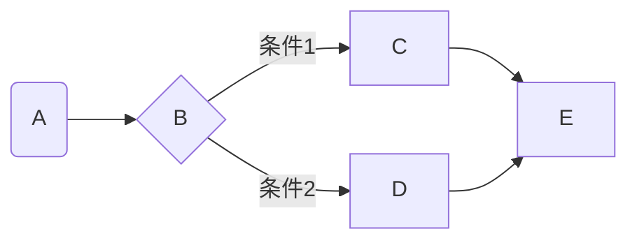

# はじめに

私は友人と共同で電子工作のマイコン制御に関するドキュメントを作ることとなりました。  
そこで、私はどんなツールを使うか考えていました...ほぼ確定していましたが。  
私はWord嫌いなので(笑)、まずWordやそのたぐいのソフトウェアは除外します。  
そこで選択肢に残るのは以下のようなものでしょう。

- Markdown
- Asciidoc
- HTML
- LaTeX

今回はMarkdown(+Vivliostyle,Slidev(後述))を使うことにしましたが、近いうちにAsciidoc版とLaTeX版の入門記事出そうと思います。  

# Markdownの特徴

Markdownには次のような特徴があります。

## 記法がかんたん

Markdownは、**数種類の記号の組み合わせを少し覚えるだけ***でそれなりに書けます*。
例えば、見出しを作りたければ

```md
# 第1レベル
## 第2レベル
### 第3レベル
#### 第4レベル
##### 第5レベル
###### 第6レベル
```

となります。同じことをHTMLでやると

```html
<h1>第1レベル</h1>
<h2>第2レベル</h2>
<h3>第3レベル</h3>
<h4>第4レベル</h4>
<h5>第5レベル</h5>
<h6>第6レベル</h6>
```

となります。  
箇条書きも

```md
- text
- text2
- text3
```

で済みます。HTMLは

```html
<ul>
    <li>text</li>
    <li>text2</li>
    <li>text3</li>
</ul>
```

と書く必要があります。  
このように、**Markdownは非常にシンプルでわかりやすい記法**となっています。

## 様々なところで使われている

上記の通り、Markdown記法は非常にシンプルでわかりやすく、覚えやすい記法なので**様々なところで使われています**。以下にその代表例を挙げます。

- Zenn,Qiitaなどの技術ブログ
- GitHubのREADME
- Discord(ただし表は未対応)
- Notion

特にDiscordについてはMarkdownを使うことで簡単に太字にしたり見出し付きのメッセージを送ったりできるので、**友達よりも一歩先を進むことができます**。

## 文章が構造化される

Markdownに限らず、このような軽量マークアップ言語は思考のじゃまにならない程度の簡単な記法で*重要なものを目立たせたり、見出しを使ってカテゴライズしたり、取り消し線を引いたりできるので、**文章を構造化しやすい**です*。
文章が構造化されていると、人に伝えるときに矛盾したり同じことをぐるぐると何回も言ったりすることを格段に減らせます。

## Gitで管理できる

これもMarkdownに限った話ではないですが、Gitを使い始めるとなんかいろんなものをGitで管理したくなりますよね?(分かる人いてほしい)
そこで、このような軽量マークアップ言語を使うと、**Gitできれいに追跡できて便利**ですし、**GitHubを活用して複数人での作業も効率化できます**。
ちなみに私は文書は基本的にMarkdownかTeXかAsciidocで作成し、楽譜をLilyPondで作成することで、私が自主的に作成する資料についてはほぼすべてをGitで管理しています。

## HTMLを直接かける

Markdownは、HTMLをシンプルに、簡単にかけるようにしたものなので、HTMLでできるけどMarkdownではできないことがたくさんあります。
そのような記述をしたいときは、**直接HTMLを書くだけ**でできます。
もちろん、`<link>`タグを使って**CSSを読み込むこともできます**。

## 図などを挿入できる

多くのMarkdownエディターではMermaidやPlantUMLといったものを用いて**図をかけます**。
例えば



は、このようにかけます。

```

```mermaid
flowchart LR

A(A) --> B{B}
B --> |条件1|C
B --> |条件2|D
C --> E
D --> E
```　//このコメントは削除してください
```

## 方言がある

ここまでMarkdownのメリットばかりお話してきたのでデメリットもお話します。
Markdownには**統一された規格が存在しません**。(あとから作ろうとしてはいるようですが、全く浸透していません)
ここでは、GitHubで使われる、**GFM** *(GitHub Flavord Markdown)* をベースに紹介します。

## 表の拡張性が低い

表では、セルの結合ができません。
ちなみに、表は以下のように書きます。

```md
| row1 | row2 | row3 |
| :--- | :---: | ---: |
| 左揃え | 中揃え | 右揃え |
| 4 | 5 | 6 |
```

| row1 | row2 | row3 |
| :--- | :---: | ---: |
| 左揃え | 中揃え | 右揃え |
| 4 | 5 | 6 |

# 執筆環境の導入

Markdownを書くためには、専用のソフトウェアが必要...ではなく、プログラミング用の汎用のコードエディターで(極論メモ帳でも)書けます。
しかし、Markdownとして表示するためにはいくつかのツールを使わなければなりません...

## Visual Studio Code (VSCode)

https://code.visualstudio.com

VSCodeはMicrosoft社謹製のコードエディターです。
オープンソースで開発されており、Windows・Mac・Linuxで使えます。

VSCodeは拡張機能を導入することで、かなり使いやすくなります。
ちなみに見た目さえガラッと変えることができます。
https://zenn.dev/haru_0205/articles/66535a3c4ba403

今回は、VSCodeに以下の拡張機能を導入しましょう。

### Markdown Preview Enhanched

https://marketplace.visualstudio.com/items?itemName=shd101wyy.markdown-preview-enhanced
LaTeXによる数式入力およびMermaidに対応したMarkdownプレビュワーです。
VSCodeでMarkdownを書きたければ必須の拡張となっています。

### Markdownlint

https://marketplace.visualstudio.com/items?itemName=DavidAnson.vscode-markdownlint

Markdown記法の間違いを指摘してくれる拡張機能...ですが、第1レベルの見出しや、URLベタ打ちとかも怒られるので、以下をsettings.jsonに追記しておきましょう。

```json
"markdownlint.config": {
    "default": true,
    "MD025": false, //複数の第1レベル見出しを許可
    "MD040": false, //コードブロック記法でコードブロックを示すことを許可
    "MD034": false, //URLベタ打ちを許可
    "MD012": false, //謎エラー回避
    "MD045": false, //写真のキャプションなしを許可
    "MD035": false //***や___を許可
}
```

おそらくこの2つを入れておけば困ることはないでしょう。
他にも"Markdown All in One" など、様々な拡張機能があるので、色々使ってみてください。

## Obsidian

https://obsidian.md/

かなり有名なMarkdownのエディターです。
VSCodeはMarkdownを書いたら隣に表示するような形ですが、Obsidianは書いて改行すると順次見出しなどが適用されます。
なお、こちらにはスマホ版もあります。
また、「Obsidian Git」という拡張機能を使うことで、Gitも使えます。
もちろんスマホ版でも対応している...はずですが、少々トラブルが多いです。

## Writerside

https://www.jetbrains.com/ja-jp/writerside/

Writersideは、チェコのJetbrains社(IntelliJ IDEAやPyCharmで有名)が作成しているドキュメント執筆環境です。2023年12月時点ではEAP:Early Access Program版として無償で利用できますが、今後どうなるかはわかりません。
ただし、学生であれば「GitHub Student Develper Pack」を用いることでJetbrains All Products Packを無償で使用できますので、心配は無用です。
https://blog.jetbrains.com/ja/2019/08/22/2105/
https://education.github.com/pack/offers

## その他

これらの他にも、Markdownの執筆環境は様々なものがあります。
しかし、私は以上の3種類しか知らないので...他の環境に関しては自分で調べてみてください...

# Markdownの書き方

## 見出し

先程も触れましたが、以下のようになります

```md
# 第1レベル
## 第2レベル
### 第3レベル
#### 第4レベル
##### 第5レベル
###### 第6レベル
```

:::details 出力

# 第1レベル

## 第2レベル

### 第3レベル

#### 第4レベル

##### 第5レベル

###### 第6レベル

:::

## 箇条書き

```md
- a
- b
  - c
  - d
1. e
2. f
1. g
```

:::details 出力

- a
- b
  - c
  - d

1. e
2. f
1. g

:::

## 表

```md
| row1 | row2 | row3 | row4 |
| --- | :--- | :---: | ---: |
| デフォルト | 左揃え | 中央揃え | 右揃え |
| 1 | 2 | 3 | 4 |
```

:::details 出力
| row1 | row2 | row3 | row4 |
| --- | :--- | :---: | ---: |
| デフォルト | 左揃え | 中央揃え | 右揃え |
| 1 | 2 | 3 | 4 |
:::

## 文字装飾

```md
**Bold**
*Italic*
***bold+Itaric***
```

:::details 出力
**Bold**
*Italic*
***bold+Itaric***
:::

## 水平線

```md
---
___<!--アンダーバー3つ(このコメントは誤作動の原因となるので消してください)-->
***
```

:::details 出力

---

___

***

:::

コメント

```md
<!--コメント-->
<!--htmlと同じように書きます-->
```

:::details 出力
<!--コメント-->
<!--htmlと同じように書きます-->
:::

## 数式(対応していないエディターもあります)

```tex
$$
x = \dfrac{-b \pm \sqrt{b^2 - 4ac}}{2a}
$$
```

:::details 出力

$$
x = \dfrac{-b \pm \sqrt{b^2 - 4ac}}{2a}
$$

:::

基本的にこの辺りを知っておけば困らないと思います

# Markdownの活用

## Pandoc

Pandocは(主に)MarkdownをWord形式やPDF、HTMLに変換するプログラムです。
https://pandoc.org/
https://pandoc-doc-ja.readthedocs.io/ja/latest/users-guide.html

PDF変換する際はTeXが必要です。
主に以下のようなコマンドで使います。

```bash
pandoc -o <変換先ファイル名> <変換元ファイル名>
```

ただし、Pandocには山のようなオプションがあります...

## Slidev

https://ja.sli.dev/
SlidevはVue.jsの開発者であるAnthony Fu氏が作成したMarkdownによるスライド作成ツールです。
Vueのコンポーネントが使えます。
使い方は後日記事にします。

## Vivliostyle

https://vivliostyle.org/ja/
CSS組版ソフトです。
基本的にMarkdownで書いたドキュメントをCSSを使って整えていく、というスタイルで使います。
最終的にPDFファイルかePUBファイルで出力が可能です。
これも後日記事にします。

# おわりに

MarkdownはやはりHTMLよりも読みやすいと感じました。
ただし、Markdownlintの設定はまた試行錯誤したほうが良いですね...

なお、この記事を書いたのは、とある友人からこのような写真を送られたからです。


...これ見てるかな...?
~~※筆者は「漢」といえるほど男らしくはないと自分では思っていますし、よくそう言われます。~~
